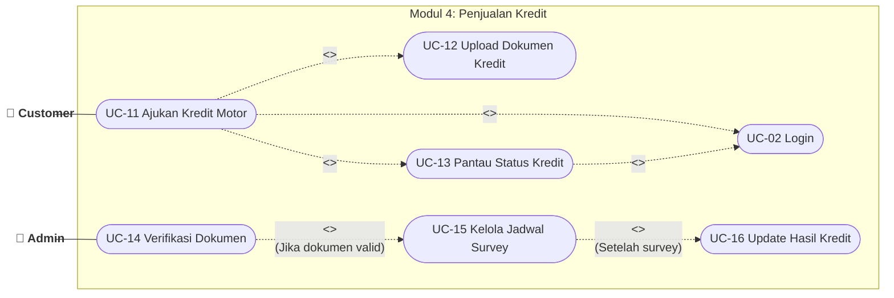
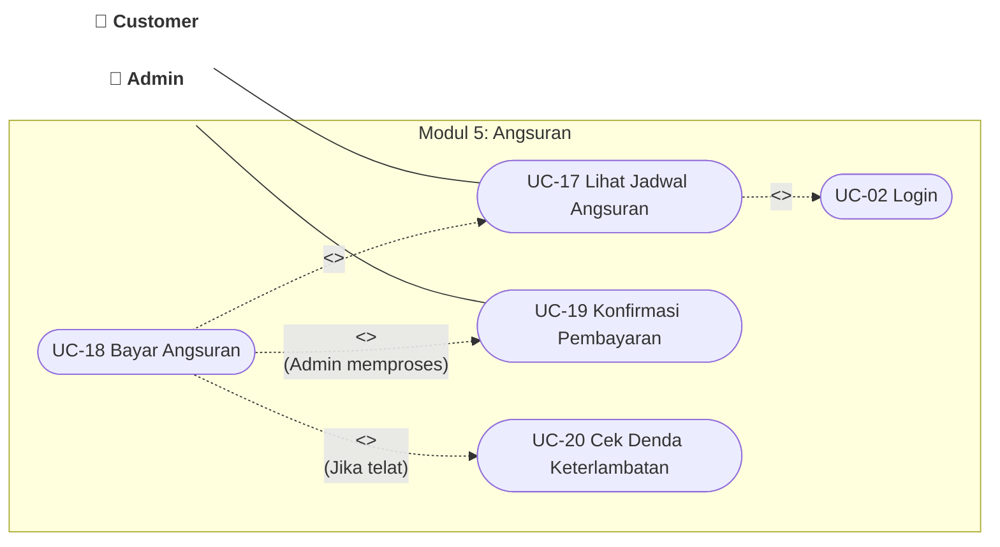

# Analisa Use Case per Modul (Lengkap dengan Include & Extend)

Dokumen ini berisi penjabaran detail 7 Modul Use Case pada Sistem Informasi SRB Motor v2. 
Setiap modul dilengkapi dengan diagram (yang dapat dirender secara otomatis) beserta tabel deskripsi fungsionalitasnya. Pendekatan modular ini sangat dianjurkan untuk dokumentasi Skripsi/Tugas Akhir yang tebal.

---

## Modul 1: Autentikasi & Profil

**Aktor:** Guest, Customer, Admin, Owner

```mermaid
flowchart LR
    %% Aktor
    Guest(["👤 Guest"])
    Customer(["👤 Customer"])
    Admin(["👤 Admin"])
    Owner(["👤 Owner"])
    
    %% Sistem
    subgraph Modul 1: Autentikasi & Profil
        direction TB
        UC1(["UC-01 Registrasi Akun"])
        UC2(["UC-02 Login"])
        UC3(["UC-03 Kelola Profil"])
    end
    
    %% Relasi Aktor
    Guest --- UC1
    Customer --- UC2
    Customer --- UC3
    Admin --- UC2
    Owner --- UC2
    Admin --- UC3
    Owner --- UC3
    
    %% Dependensi
    UC3 -. "<<include>>" .-> UC2
    UC2 -. "<<extend>>\n(Jika belum punya akun)" .-> UC1
    
    classDef actor fill:transparent,stroke:none,font-weight:bold;
    class Guest,Customer,Admin,Owner actor;
```

| Use Case | Keterangan | Relasi Tambahan |
| :--- | :--- | :--- |
| **UC-01 Registrasi Akun** | Pembuatan akun baru oleh pengguna awam. | - |
| **UC-02 Login** | Autentikasi untuk masuk ke dalam sistem. | *Extend* ke UC-01 |
| **UC-03 Kelola Profil** | Mengubah data diri dan password. | *Include* UC-02 |

---

## Modul 2: Katalog & Simulasi

**Aktor:** Guest, Customer

```mermaid
flowchart LR
    Guest(["👤 Guest"])
    Customer(["👤 Customer"])
    
    subgraph Modul 2: Katalog & Simulasi
        direction TB
        UC4(["UC-04 Lihat Katalog Motor"])
        UC5(["UC-05 Simulasi Kredit"])
        UC6(["UC-06 Lihat Detail Motor"])
    end
    
    Guest --- UC4
    Guest --- UC5
    Customer --- UC4
    Customer --- UC5
    
    UC5 -. "<<include>>" .-> UC4
    UC4 -. "<<extend>>\n(Klik detail)" .-> UC6
    
    classDef actor fill:transparent,stroke:none,font-weight:bold;
    class Guest,Customer actor;
```

| Use Case | Keterangan | Relasi Tambahan |
| :--- | :--- | :--- |
| **UC-04 Lihat Katalog** | Menampilkan daftar seluruh motor. | *Extend* ke UC-06 |
| **UC-05 Simulasi Kredit** | Kalkulator estimasi DP dan cicilan. | *Include* UC-04 |
| **UC-06 Lihat Detail Motor** | Menampilkan spesifikasi lengkap 1 unit motor. | - |

---

## Modul 3: Penjualan Tunai

**Aktor:** Customer, Admin

```mermaid
flowchart LR
    Customer(["👤 Customer"])
    Admin(["👤 Admin"])
    
    subgraph Modul 3: Penjualan Tunai
        direction TB
        UC2(["UC-02 Login"])
        UC7(["UC-07 Pesan Motor Tunai"])
        UC8(["UC-08 Upload Dokumen KTP/KK"])
        UC9(["UC-09 Bayar Booking Fee"])
        UC10(["UC-10 Konfirmasi Transaksi"])
    end
    
    Customer --- UC7
    Admin --- UC10
    
    UC7 -. "<<include>>" .-> UC2
    UC7 -. "<<include>>" .-> UC8
    UC7 -. "<<include>>" .-> UC9
    UC7 -. "<<extend>>\n(Admin memproses)" .-> UC10
    
    classDef actor fill:transparent,stroke:none,font-weight:bold;
    class Customer,Admin actor;
```

| Use Case | Keterangan | Relasi Tambahan |
| :--- | :--- | :--- |
| **UC-07 Pesan Motor Tunai** | Melakukan checkout pesanan secara tunai. | *Include* UC-02, UC-08, UC-09. *Extend* ke UC-10. |
| **UC-08 Upload Dokumen** | Mengunggah syarat KTP dan KK. | - |
| **UC-09 Bayar Booking Fee** | Pembayaran via Payment Gateway. | - |
| **UC-10 Konfirmasi Transaksi**| Admin memvalidasi pesanan dan pembayaran. | - |

---

## Modul 4: Penjualan Kredit

**Aktor:** Customer, Admin



| Use Case | Keterangan | Relasi Tambahan |
| :--- | :--- | :--- |
| **UC-11 Ajukan Kredit** | Form pengajuan kredit via leasing. | *Include* UC-02, UC-12. *Extend* ke UC-13. |
| **UC-12 Upload Syarat** | KTP, KK, Slip Gaji, dll. | - |
| **UC-13 Pantau Status** | Melihat progres (Survey/Approve/Reject). | *Include* UC-02 |
| **UC-14 Verifikasi Dokumen**| Admin mengecek kelengkapan awal. | *Extend* ke UC-15 |
| **UC-15 Jadwal Survey** | Penentuan tanggal kunjungan surveyor. | *Extend* ke UC-16 |
| **UC-16 Update Hasil** | Memasukkan status final dari Leasing. | - |

---

## Modul 5: Pembayaran Angsuran

**Aktor:** Customer, Admin



| Use Case | Keterangan | Relasi Tambahan |
| :--- | :--- | :--- |
| **UC-17 Lihat Jadwal** | Melihat sisa tenor dan jatuh tempo. | *Include* UC-02 |
| **UC-18 Bayar Angsuran** | Membayar cicilan berjalan. | *Include* UC-17. *Extend* ke UC-19, UC-20. |
| **UC-19 Konfirmasi** | Verifikasi pembayaran oleh Admin. | - |
| **UC-20 Cek Denda** | Kalkulasi denda otomatis jika overdue. | - |

---

## Modul 6: Booking Service

**Aktor:** Customer, Admin

```mermaid
flowchart LR
    Customer(["👤 Customer"])
    Admin(["👤 Admin"])
    
    subgraph Modul 6: Booking Service
        direction TB
        UC2(["UC-02 Login"])
        UC21(["UC-21 Booking Service"])
        UC22(["UC-22 Pilih Cabang & Waktu"])
        UC23(["UC-23 Konfirmasi Booking"])
        UC24(["UC-24 Batalkan Booking"])
    end
    
    Customer --- UC21
    Admin --- UC23
    
    UC21 -. "<<include>>" .-> UC2
    UC21 -. "<<include>>" .-> UC22
    
    UC21 -. "<<extend>>" .-> UC23
    UC21 -. "<<extend>>\n(Batal oleh user)" .-> UC24
    
    classDef actor fill:transparent,stroke:none,font-weight:bold;
    class Customer,Admin actor;
```

| Use Case | Keterangan | Relasi Tambahan |
| :--- | :--- | :--- |
| **UC-21 Booking Service** | Form pendaftaran servis motor. | *Include* UC-02, UC-22. *Extend* ke UC-23, UC-24. |
| **UC-22 Pilih Cabang** | Menentukan lokasi dan jam servis. | - |
| **UC-23 Konfirmasi** | Admin menyetujui jadwal & terbit antrean.| - |
| **UC-24 Batalkan Booking**| Pembatalan jadwal sebelum hari H. | - |

---

## Modul 7: Dashboard & Manajemen

**Aktor:** Admin, Owner

```mermaid
flowchart LR
    Admin(["👤 Admin"])
    Owner(["👤 Owner"])
    
    subgraph Modul 7: Manajemen
        direction TB
        UC25(["UC-25 Kelola Stok Motor"])
        UC26(["UC-26 Kelola Pengguna"])
        UC27(["UC-27 Lihat Dashboard"])
        UC28(["UC-28 Lihat Laporan Penjualan"])
    end
    
    Admin --- UC25
    Owner --- UC26
    Owner --- UC27
    
    UC27 -. "<<include>>" .-> UC28
    UC27 -. "<<extend>>\n(Monitor sisa stok)" .-> UC25
    
    classDef actor fill:transparent,stroke:none,font-weight:bold;
    class Admin,Owner actor;
```

| Use Case | Keterangan | Relasi Tambahan |
| :--- | :--- | :--- |
| **UC-25 Kelola Stok** | Update persediaan unit (Admin). | - |
| **UC-26 Kelola Pengguna**| Hak akses staf & user (Owner). | - |
| **UC-27 Lihat Dashboard**| Ringkasan metrik penjualan utama. | *Include* UC-28. *Extend* ke UC-25. |
| **UC-28 Laporan Penjualan**| Export data Excel/PDF detail. | - |
