# SRB Motor Database ERD (Complete & Consolidated)

Dokumen ini menyediakan diagram *Entity Relationship Diagram* (ERD) lengkap untuk aplikasi SRB Motor, mencakup logika bisnis inti, manajemen data, dan pengaturan sistem. Relasi antar entitas disajikan dengan penjelasan kardinalitas (seperti *One-to-Many* / *One-to-One*) beserta label dalam bahasa Indonesia.

## Entity Relationship Diagram

```mermaid
erDiagram
    USERS ||--o{ TRANSACTIONS : "One-to-Many (Melakukan/Membuat)"
    MOTORS ||--o{ TRANSACTIONS : "One-to-Many (Terjual dalam)"
    TRANSACTIONS ||--o{ TRANSACTION_LOGS : "One-to-Many (Tercatat dalam)"
    TRANSACTIONS ||--o{ DOCUMENTS : "One-to-Many (Membutuhkan)"
    TRANSACTIONS ||--o| CREDIT_DETAILS : "One-to-One (Memiliki riwayat kredit)"
    CREDIT_DETAILS ||--o{ INSTALLMENTS : "One-to-Many (Memiliki angsuran)"
    CREDIT_DETAILS ||--o{ SURVEY_SCHEDULES : "One-to-Many (Memiliki jadwal survei)"
    USERS ||--o{ NOTIFICATIONS : "One-to-Many (Menerima)"
    USERS ||--o{ SERVICE_APPOINTMENTS : "One-to-Many (Memesan)"

    USERS {
        bigint id PK
        string name
        string email
        string password
        string role
        string phone
        string google_id
        text alamat
        string nik
        string occupation
        decimal monthly_income
        timestamp created_at
        timestamp updated_at
    }

    MOTORS {
        bigint id PK
        string name
        string brand
        string model
        string slug
        decimal price
        string image_path
        text details
        boolean tersedia
        decimal min_dp_amount
        json colors
        timestamp created_at
        timestamp updated_at
    }

    TRANSACTIONS {
        bigint id PK
        bigint user_id FK
        bigint motor_id FK
        string name "Customer Name"
        string email "Customer Email"
        string phone "Customer Phone"
        string nik "Customer NIK"
        text address "Customer Address"
        string reference_number
        string transaction_type
        string status
        string motor_color
        decimal motor_price
        decimal booking_fee
        decimal total_price
        decimal final_price
        string delivery_method
        date delivery_date
        string occupation
        decimal monthly_income
        string employment_duration
        string payment_method
        timestamp cancelled_at
        text cancellation_reason
        text notes
        timestamp created_at
        timestamp updated_at
        timestamp deleted_at
    }

    CREDIT_DETAILS {
        bigint id PK
        bigint transaction_id FK
        string leasing_provider
        string status
        string reference_number
        int tenor
        decimal interest_rate
        decimal monthly_installment
        text verification_notes
        timestamp verified_at
        decimal dp_amount
        timestamp dp_paid_at
        string dp_payment_method
        timestamp completed_at
        text completion_notes
        boolean is_completed
        timestamp created_at
        timestamp updated_at
        timestamp deleted_at
    }

    INSTALLMENTS {
        bigint id PK
        bigint transaction_id FK
        int installment_number
        decimal amount
        date due_date
        timestamp paid_at
        string status
        string payment_method
        text payment_proof
        string snap_token
        string midtrans_booking_code
        boolean is_overdue
        int days_overdue
        decimal penalty_amount
        decimal total_with_penalty
        boolean reminder_sent
        timestamp reminder_sent_at
        text notes
        timestamp created_at
        timestamp updated_at
    }

    DOCUMENTS {
        bigint id PK
        bigint credit_detail_id FK
        string document_type
        text description
        string file_path
        string original_name
        bigint file_size
        string status
        string approval_status
        text rejection_reason
        timestamp reviewed_at
        timestamp submitted_at
        timestamp created_at
        timestamp updated_at
    }

    TRANSACTION_LOGS {
        bigint id PK
        bigint transaction_id FK
        string status_from
        string status_to
        string status "Legacy"
        bigint actor_id
        string actor_type
        text description
        text notes
        json payload
        timestamp created_at
        timestamp updated_at
    }

    SURVEY_SCHEDULES {
        bigint id PK
        bigint credit_detail_id FK
        date scheduled_date
        time scheduled_time
        string surveyor_name
        string surveyor_phone
        string status
        string location
        text notes
        text customer_notes
        boolean customer_confirms
        timestamp customer_confirmed_at
        text customer_confirmation_notes
        timestamp completed_at
        text survey_result
        text findings
        timestamp created_at
        timestamp updated_at
        timestamp deleted_at
    }

    SETTINGS {
        bigint id PK
        string key
        longtext value
        string type
        string category
        text description
        timestamp created_at
        timestamp updated_at
    }

    NOTIFICATIONS {
        char id PK
        string type
        string notifiable_type
        bigint notifiable_id
        text data
        timestamp read_at
        timestamp created_at
        timestamp updated_at
    }
    
    SERVICE_APPOINTMENTS {
        bigint id PK
        bigint user_id FK
        string customer_name
        string customer_phone
        string motor_brand
        string motor_type
        string license_plate
        int current_km
        date service_date
        time service_time
        string service_type
        text complaint_notes
        decimal estimated_cost
        string status
        string branch
        string cancelled_by
        text cancel_reason
        text admin_notes
        timestamp created_at
        timestamp updated_at
    }
```

## Detail Relasi & Penjelasan

| Entitas Utama | Entitas Terkait | Jenis Relasi | Keterangan / Sebutan Relasi |
|:---|:---|:---|:---|
| **Users** | `Transactions` | 1:N *(One to Many)* | Satu *User* dapat **Membeli/Memiliki** banyak *Transactions*. Sebaliknya, sebuah *Transaction* hanya dimiliki oleh satu *User*. |
| **Users** | `Service_Appointments`| 1:N *(One to Many)* | Satu *User* dapat **Memesan** banyak riwayat *Service/Booking*. |
| **Users** | `Notifications`| 1:N *(One to Many)* | Satu *User* **Menerima** banyak pemberitahuan (*Notifications*). |
| **Motors** | `Transactions` | 1:N *(One to Many)* | Tipe/model *Motor* tertentu dapat **Terjual Dalam** banyak transaksi oleh *User* yang berbeda. |
| **Transactions** | `Credit_Details`| 1:1 *(One to One)* | Sebuah transaksi kredit **Hanya Memiliki** maksimal 1 entitas *Credit Detail*. Transaksi tunai (*cash*) memiliki nol (*zero*). |
| **Transactions** | `Documents`| 1:N *(One to Many)* | Sebuah transaksi (terutama kredit) **Membutuhkan** banyak verifikasi *Documents* (KTP, KK, Bukti Penghasilan). |
| **Transactions** | `Transaction_Logs`| 1:N *(One to Many)* | Tiap transaksi akan **Tertulis Dalam** berbagai log pelacakan perubahan status administrasi per harinya. |
| **Credit_Details** | `Installments` | 1:N *(One to Many)* | Informasi kredit akan **Memiliki** sekian daftar cicilan per bulan. (Satu *Credit Detail* menelurkan 12-36 *Installments*). |
| **Credit_Details** | `Survey_Schedules`| 1:N *(One to Many)* | *Credit Detail* dapat **Mengagendakan** banyak jadwal pengajuan survei jika misal survei gagal/direschedule ulang. |

## Rangkuman Tabel Aktif Aplikasi

| Tabel MySQL | Total Kolom | Fungsi Utama |
|:---|:---:|:---|
| `users` | 13 | Data terpadu hak akses, akun, & detil pribadi pelanggan |
| `motors` | 13 | Katalog unit sepeda motor dari DB (*Brand*, JSON *Colors*, Minimum DP, dll) |
| `transactions` | 28 | Tabel induk catatan pembelian inti (Mendukung Pembayaran *Cash* / *Kredit*) |
| `credit_details` | 19 | Lanjutan *Transactions*, melacak pencairan *Leasing* & alur survei khusus cicilan |
| `installments` | 20 | Catatan individual tenggat waktu pembayaran dan histori penalti denda |
| `documents` | 14 | Lemari arsip file KYC pendukung proses verifikasi pembelian motor |
| `transaction_logs` | 12 | Sistem pencatatan jejak perubahan (*Audit Trail*) pergantian rute status pemesanan |
| `survey_schedules` | 19 | Koordinasi tatap muka jadwal pengecekan kelayakan antara *Surveyor* dan akun *User* |
| `settings` | 8 | Parameter sistem global dinamis seperti (*Site Name*, Alamat, Jam Operasional) |
| `notifications` | 8 | Fitur penyiaran sistem berbasis riwayat acara (Disematkan ke ID Pengguna terkait) |
| `service_appointments` | 20 | Sistem reservasi modul purna jual *Booking* rawat motor, *budgeting* keluhan, & kuota |

*Catatan: Tabel infrastruktur dasar Laravel (seperti basis migrasi, singgahan cache, antrian job, sesi riwayat, dan basis token sandi/akses personal) ditiadakan dari ERD (*Entity Relationship Diagram*) ini demi fokus penyederhanaan dokumentasi ke logika bisnis produk.*
