# SRB Motor Database ERD (Complete & Consolidated)

This document provides the full Entity Relationship Diagram (ERD) for the SRB Motor application, including core business logic, content management, and system settings.

## Entity Relationship Diagram

```mermaid
erDiagram
    USERS ||--o{ TRANSACTIONS : "makes"
    CATEGORIES ||--o{ POSTS : "classifies articles"
    MOTORS ||--o{ TRANSACTIONS : "is sold in"
    TRANSACTIONS ||--o{ TRANSACTION_LOGS : "has"
    TRANSACTIONS ||--o{ DOCUMENTS : "requires"
    TRANSACTIONS ||--o| CREDIT_DETAILS : "has if credit"
    LEASING_PROVIDERS ||--o{ CREDIT_DETAILS : "provides"
    CREDIT_DETAILS ||--o{ INSTALLMENTS : "has"
    CREDIT_DETAILS ||--o{ SURVEY_SCHEDULES : "has"
    USERS ||--o{ NOTIFICATIONS : "receives"

    USERS {
        bigint id PK
        string name
        string email
        string password
        string role
        string phone
        string google_id
        text alamat
        string nik
        string no_hp_backup
        string jenis_kelamin
        date tanggal_lahir
        string occupation
        decimal monthly_income
        string nama_ibu_kandung
        timestamp created_at
        timestamp updated_at
    }

    MOTORS {
        bigint id PK
        string name
        string brand
        string model
        string slug
        decimal price
        string image_path
        text details
        boolean tersedia
        decimal min_dp_amount
        json colors
        timestamp created_at
        timestamp updated_at
    }

    TRANSACTIONS {
        bigint id PK
        bigint user_id FK
        bigint motor_id FK
        string name "Customer Name"
        string email "Customer Email"
        string phone "Customer Phone"
        string nik "Customer NIK"
        text address "Customer Address"
        string reference_number
        string transaction_type
        string status
        string motor_color
        decimal motor_price
        decimal booking_fee
        decimal total_price
        decimal discount_amount
        decimal final_price
        string delivery_method
        date delivery_date
        string occupation
        decimal monthly_income
        string employment_duration
        string payment_method
        timestamp payment_date
        text payment_proof
        timestamp cancelled_at
        text cancellation_reason
        text notes
        timestamp created_at
        timestamp updated_at
        timestamp deleted_at
    }

    CREDIT_DETAILS {
        bigint id PK
        bigint transaction_id FK
        bigint leasing_provider_id FK
        string status
        string reference_number
        int tenor
        decimal interest_rate
        decimal monthly_installment
        decimal total_interest
        text verification_notes
        timestamp verified_at
        decimal dp_amount
        timestamp dp_paid_at
        string dp_payment_method
        timestamp unit_prepared_at
        timestamp ready_for_delivery_at
        timestamp delivered_at
        timestamp completed_at
        text completion_notes
        boolean is_completed
        timestamp created_at
        timestamp updated_at
        timestamp deleted_at
    }

    INSTALLMENTS {
        bigint id PK
        bigint transaction_id FK
        int installment_number
        decimal amount
        date due_date
        timestamp paid_at
        string status
        string payment_method
        text payment_proof
        string snap_token
        string midtrans_booking_code
        boolean is_overdue
        int days_overdue
        decimal penalty_amount
        decimal total_with_penalty
        boolean reminder_sent
        timestamp reminder_sent_at
        text notes
        timestamp created_at
        timestamp updated_at
    }

    DOCUMENTS {
        bigint id PK
        bigint credit_detail_id FK
        string document_type
        text description
        string file_path
        string original_name
        bigint file_size
        string status
        string approval_status
        text rejection_reason
        timestamp reviewed_at
        timestamp submitted_at
        timestamp created_at
        timestamp updated_at
    }

    CATEGORIES {
        bigint id PK
        string name
        string slug
        text description
        string icon
        int order
        boolean is_active
        timestamp created_at
        timestamp updated_at
    }

    LEASING_PROVIDERS {
        bigint id PK
        string name
        string logo_path
        timestamp created_at
        timestamp updated_at
    }

    TRANSACTION_LOGS {
        bigint id PK
        bigint transaction_id FK
        string status_from
        string status_to
        string status "Legacy"
        bigint actor_id
        string actor_type
        text description
        text notes
        json payload
        timestamp created_at
        timestamp updated_at
    }

    SURVEY_SCHEDULES {
        bigint id PK
        bigint credit_detail_id FK
        date scheduled_date
        time scheduled_time
        string surveyor_name
        string surveyor_phone
        string status
        string location
        text notes
        text customer_notes
        boolean customer_confirms
        timestamp customer_confirmed_at
        timestamp completed_at
        timestamp created_at
        timestamp updated_at
    }

    POSTS {
        bigint id PK
        bigint category_id FK
        string title
        string slug
        text content
        string featured_image
        string status
        bigint views
        timestamp published_at
        timestamp created_at
        timestamp updated_at
    }

    SETTINGS {
        bigint id PK
        string key
        longtext value
        string type
        string category
        text description
        timestamp created_at
        timestamp updated_at
    }

    NOTIFICATIONS {
        char id PK
        string type
        string notifiable_type
        bigint notifiable_id
        text data
        timestamp read_at
        timestamp created_at
        timestamp updated_at
    }
```

## Application Tables Summary

| Table | Columns | Purpose |
|:---|:---:|:---|
| `users` | 20 | Unified User & Profile Data |
| `motors` | 13 | Motorcycle Catalog & Stock Status |
| `transactions` | 31 | Core Sales Records (Cash/Credit) |
| `credit_details` | 23 | Leasing & Approval Workflow |
| [installments](file:///d:/laragon/www/SrbMotor/app/Models/Transaction.php#106-113) | 21 | Payment Tracking & Deadlines |
| `documents` | 15 | Identity Files & Verification |
| `categories` | 9 | Article Grouping |
| `leasing_providers` | 5 | Financing Partners |
| `transaction_logs` | 12 | Audit Trail for Status Changes |
| `survey_schedules` | 21 | Survey Coordination Detail |
| `posts` | 12 | Blog/News Content Management |
| `settings` | 8 | Global System Configuration |
| `notifications` | 8 | User Alert System |

**Total Application Tables:** 13
**Total Application Columns:** 188

*Note: System tables (migrations, cache, jobs, sessions, tokens) are excluded from this ERD as they do not contain business logic.*
