# SRB Motor Database ERD (Complete & Verified)

Dokumen ini menyediakan diagram *Entity Relationship Diagram* (ERD) yang telah diverifikasi langsung melalui audit database live `srbmotor`. Diagram ini mencakup logika bisnis inti, manajemen data kredit, dan fitur purna jual.

## Entity Relationship Diagram

```mermaid
erDiagram
    USERS ||--o{ TRANSACTIONS : "One-to-Many (Melakukan)"
    MOTORS ||--o{ TRANSACTIONS : "One-to-Many (Terjual dalam)"
    TRANSACTIONS ||--o{ TRANSACTION_LOGS : "One-to-Many (Tercatat dalam)"
    TRANSACTIONS ||--o{ INSTALLMENTS : "One-to-Many (Memiliki cicilan)"
    TRANSACTIONS ||--o| CREDIT_DETAILS : "One-to-One (Memiliki detail kredit)"
    CREDIT_DETAILS ||--o{ DOCUMENTS : "One-to-Many (Menyimpan berkas)"
    CREDIT_DETAILS ||--o{ SURVEY_SCHEDULES : "One-to-Many (Memiliki jadwal survei)"
    USERS ||--o{ NOTIFICATIONS : "One-to-Many (Menerima)"
    USERS ||--o{ SERVICE_APPOINTMENTS : "One-to-Many (Memesan servis)"

    USERS {
        bigint id PK
        string name
        string email
        string password
        string role
        string google_id
        string profile_photo_path
        string phone
        text alamat
        string nik
        string occupation
        decimal monthly_income
        timestamp email_verified_at
        string remember_token
        timestamp created_at
        timestamp updated_at
    }

    MOTORS {
        bigint id PK
        string name
        string brand
        string model
        decimal price
        decimal min_dp_amount
        json colors
        integer year
        string type
        string image_path
        text details
        boolean tersedia
        timestamp created_at
        timestamp updated_at
    }

    TRANSACTIONS {
        bigint id PK
        bigint user_id FK
        bigint motor_id FK
        string name "Customer Name"
        string nik "Customer NIK"
        string reference_number
        string transaction_type
        string status
        string motor_color
        decimal motor_price
        decimal booking_fee
        string phone
        string email
        text address
        string delivery_method
        date delivery_date
        string occupation
        decimal monthly_income
        string employment_duration
        decimal total_price
        decimal final_price
        string payment_method
        timestamp cancelled_at
        text cancellation_reason
        text notes
        timestamp created_at
        timestamp updated_at
        timestamp deleted_at
    }

    CREDIT_DETAILS {
        bigint id PK
        bigint transaction_id FK
        string leasing_provider
        string status
        string reference_number
        int tenor
        decimal interest_rate
        decimal monthly_installment
        text verification_notes
        timestamp verified_at
        decimal dp_amount
        timestamp dp_paid_at
        string dp_payment_method
        timestamp completed_at
        text completion_notes
        boolean is_completed
        timestamp created_at
        timestamp updated_at
        timestamp deleted_at
    }

    INSTALLMENTS {
        bigint id PK
        bigint transaction_id FK
        int installment_number
        date due_date
        decimal amount
        string status
        timestamp paid_at
        string payment_method
        text payment_proof
        string snap_token
        string midtrans_booking_code
        boolean is_overdue
        int days_overdue
        decimal penalty_amount
        decimal total_with_penalty
        boolean reminder_sent
        timestamp reminder_sent_at
        text notes
        timestamp created_at
        timestamp updated_at
        timestamp deleted_at
    }

    DOCUMENTS {
        bigint id PK
        bigint credit_detail_id FK
        string document_type
        string description
        string file_path
        string original_name
        string file_size
        string status
        string approval_status
        text rejection_reason
        timestamp reviewed_at
        timestamp submitted_at
        timestamp created_at
        timestamp updated_at
        timestamp deleted_at
    }

    SURVEY_SCHEDULES {
        bigint id PK
        bigint credit_detail_id FK
        datetime scheduled_date
        time scheduled_time
        string surveyor_name
        string surveyor_phone
        string status
        string location
        text notes
        text customer_notes
        boolean customer_confirms
        timestamp customer_confirmed_at
        text customer_confirmation_notes
        timestamp completed_at
        text survey_result
        text findings
        timestamp created_at
        timestamp updated_at
        timestamp deleted_at
    }

    TRANSACTION_LOGS {
        bigint id PK
        bigint transaction_id FK
        string status_from
        string status_to
        bigint actor_id
        string actor_type
        text description
        text notes
        json payload
        timestamp created_at
        timestamp updated_at
        string status
    }

    SERVICE_APPOINTMENTS {
        bigint id PK
        bigint user_id FK
        string branch
        string customer_name
        string customer_phone
        string motor_brand
        string motor_type
        string license_plate
        int current_km
        date service_date
        time service_time
        string service_type
        text complaint_notes
        decimal estimated_cost
        string status
        string cancelled_by
        text cancel_reason
        text admin_notes
        timestamp created_at
        timestamp updated_at
    }

    SETTINGS {
        bigint id PK
        string key
        longtext value
        string type
        string category
        text description
        timestamp created_at
        timestamp updated_at
    }

    NOTIFICATIONS {
        char id PK
        string type
        string notifiable_type
        bigint notifiable_id
        text data
        timestamp read_at
        timestamp created_at
        timestamp updated_at
    }
```

## Detail Relasi & Penjelasan

| Entitas Utama | Entitas Terkait | Jenis Relasi | Keterangan / Sebutan Relasi |
|:---|:---|:---|:---|
| **Users** | `Transactions` | 1:N *(One to Many)* | Satu *User* dapat melakukan banyak transaksi pembelian. |
| **Users** | `Service_Appointments`| 1:N *(One to Many)* | Satu *User* dapat melakukan banyak pemesanan layanan bengkel. |
| **Motors** | `Transactions` | 1:N *(One to Many)* | Satu model *Motor* dapat terjual dalam berbagai transaksi. |
| **Transactions** | `Credit_Details`| 1:1 *(One to One)* | Transaksi kredit memiliki satu entitas detil pembiayaan. |
| **Transactions** | `Installments`| 1:N *(One to Many)* | Satu transaksi (Kredit/Cash Bertahap) memiliki riwayat cicilan. |
| **Credit_Details** | `Documents`| 1:N *(One to Many)* | Detil kredit menyimpan berbagai berkas KYC (KTP, KK, dsb). |
| **Credit_Details** | `Survey_Schedules`| 1:N *(One to Many)* | Detil kredit dapat memiliki beberapa agenda survei fisik. |

## Rangkuman Tabel Aktif Aplikasi

| Tabel MySQL | Total Kolom | Fungsi Utama |
|:---|:---:|:---|
| `users` | 16 | Data identitas utama dan akun pengguna (verified) |
| `motors` | 14 | Katalog unit motor dengan detil tipe, warna, dan harga (verified) |
| `transactions` | 28 | Pencatatan transaksi utama (Cash & Kredit) (verified) |
| `credit_details` | 19 | Detil pembiayaan leasing dan persetujuan survei (verified) |
| `installments` | 21 | Pengelolaan cicilan, penalti, dan status Midtrans (verified) |
| `documents` | 15 | Manajemen berkas dokumen persyaratan kredit (verified) |
| `survey_schedules` | 19 | Penjadwalan dan hasil laporan survei lapangan (verified) |
| `transaction_logs` | 12 | Audit trail untuk setiap perubahan status transaksi (verified) |
| `service_appointments` | 20 | Reservasi layanan servis bengkel (Purna Jual) (verified) |
| `settings` | 8 | Konfigurasi global sistem (verified) |
| `notifications` | 8 | Notifikasi sistem berbasis akun (verified) |

---

*Catatan: Dokumentasi ini dihasilkan dari audit langsung pada database `srbmotor` port 3306. Kolom-kolom yang ada di file migrasi namun tidak ditemukan di live DB (seperti `no_ktp` di tabel users) telah dihilangkan demi akurasi.*
