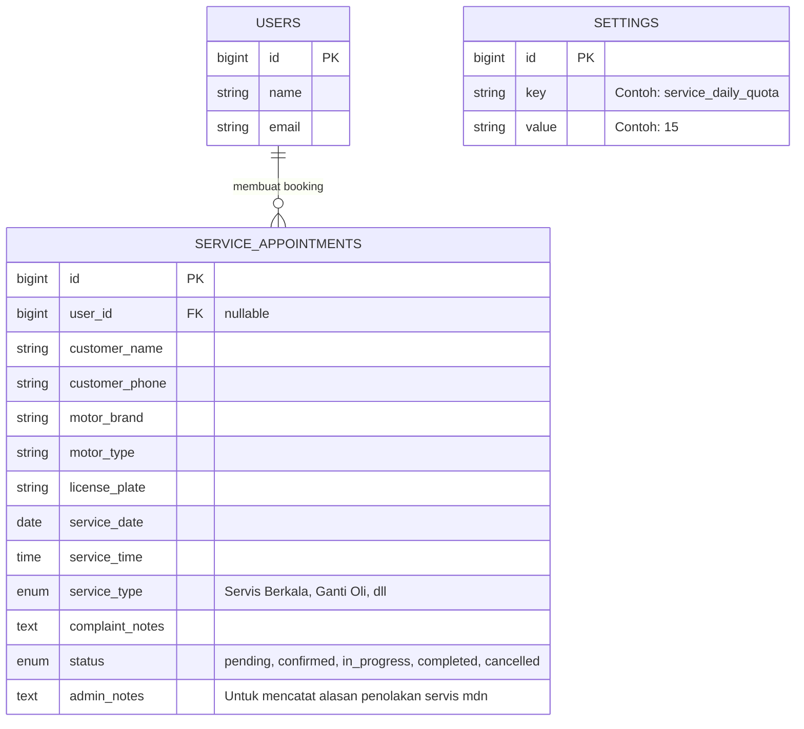

# Rencana Pengembangan Fitur Servis & Manajemen Kuota

**Sistem Informasi Dealer SRB Motor (Powered by SSM)**

Dokumen ini berisi spesifikasi teknis dan desain alur kerja (workflow) untuk fitur Reservasi Servis Motor menggunakan pendekatan **Sistem Kuota Harian & Setup Admin Manual** (Gabungan Opsi 1 & 2). Sistem ini dirancang untuk menjawab tantangan jika mekanik sedang libur/berhalangan dengan cara administratif tanpa harus membuat tabel mekanik yang kompleks.

---

## 1. Konsep Utama & Solusi

Untuk memecahkan masalah _"Bagaimana mencegah user set booking saat mekanik tidak ada?"_, kita akan menggunakan dua filter pertahanan utama:

1. **Filter Otomatis (Daily Quota):** Kalender akan otomatis dikunci (disable) di frontend jika di hari tersebut sudah ada lebih dari _X_ booking yang `confirmed`/`pending` (misal kuota max 15 motor per hari dari Admin Setting).
2. **Filter Manual (Admin Override):** Meskipun belum limit 15 motor, bisa saja mekanik tiba-tiba sakit di pagi hari. Di tahap ini, Admin mengambil kontrol untuk langsung membatalkan (`cancelled`) atau mengirim opsi _reschedule_ melalui notifikasi WhatsApp/Email ke pelanggan baru beserta catatan aslinya (`admin_notes`).

---

## 2. Struktur Database (Schema & ERD)

Struktur tabel sangat _clean_, langsung merelasikan User dan Reservasi Servis miliknya. Tidak dibutuhkan tabel Mekanik tambahan.

### Entity Relationship Diagram (ERD)

---

## 3. Alur Sistem (Business Logic Workflow)

### A. Alur Pelanggan (User / Customer)

1. User masuk ke halaman **Booking Servis**.
2. User memilih Tanggal Servis di Kalender interaktif.
3. **Validasi Kuota Harian & Transparansi UI Frontend (Rule Otomatis):**
    - _Logika:_ Sistem menghitung `COUNT` (Reservasi berstatus `pending` + `confirmed`) pada tanggal tersebut.
    - _Tampilan Visual (User Experience):_ Agar pengguna tidak bingung, komponen Kalender di halaman React akan diberikan **Indikator Warna (Legend)** yang sangat jelas:
        - 🟩 **Hijau:** Slot mekanik tersedia.
        - 🟥 **Merah / Abu-abu (Disabled):** Kuota sudah _Full_ atau Mekanik sedang libur. Tanggal ini **dikunci dan tidak bisa diklik**.
        - 💬 **Pesan Peringatan / Tooltip:** Saat _user_ mengarahkan kursor/jari ke tanggal yang merah, akan muncul tulisan: _"Mohon Maaf, Kuota Servis Penuh / Mekanik Tidak Tersedia pada tanggal ini."_
        - ℹ️ Akan dipasang _Banner Info_ di atas kalender: _"Silakan pilih jadwal yang berwarna hijau. Tanggal yang terkunci menandakan mekanik kami sudah full book atau sedang tidak beroperasi."_
4. Jika aman (jadwal hijau dipilih), user mengisi identitas motor & waktu keluhan -> Klik Submit.
5. Reservasi berstatus awal **`Pending`**.

### B. Alur Penanganan Real-time (Admin)

1. Muncul notifikasi pendaftaran servis baru di Dashboard Admin.
2. Admin melihat _database_ kehadiran fisik mekanik hari itu.
    - **Jika Mekanik Ada:** Admin menekan **"Konfirmasi Booking"** (status -> `confirmed`).
    - **Jika Mekanik Sakit/Tidak Ada:** Walau kuota masih ada, admin menekan **"Tolak / Reschedule"** (status -> `cancelled`). Admin mengisi popup alasan: _"Mohon maaf, mekanik sedang sakit/absen hari ini. Silahkan booking ulang untuk hari esok."_ Alasan ini tersimpan di `admin_notes`.
3. Selesai diklik, Sistem mengirim notifikasi via WhatsApp/Email ke Pelanggan.

### C. Alur Pengerjaan (Hari H)

1. Admin memantau daftar servis berstatus `confirmed` hari itu.
2. Setelah pelanggan datang, Admin mengubah status motor tersebut menjadi `in_progress`.
3. Setelah motor beres ditangani, sistem diubah menjadi `completed`.

---

## 4. Keunggulan Sistem Secara Akademik & Praktikal

Jika dipertanyakan oleh Dosen terkait sistem Booking, pendekatan hibrida Opsi 1 & 2 ini memiliki beberapa justifikasi ampuh:

- **Anti Over-Engineering:** Sistem ini memuaskan sisi praktikal lapangan (bengkel kecil-menengah). Mekanik bengkel biasa sering silih berganti atau _freelance_, sehingga pendataan absen mekanik super kompleks malah menambah birokrasi yang membebani Admin.
- **Human-in-the-Loop Backup:** Kombinasi pencegahan otomasi (_Daily Quota_) dan keputusan manusia (_Admin Approval & Reason_) menghasilkan tingkat operasional yang sangat realistis untuk bisnis _dealership independent_ (SSM).

---

## 5. Rencana Eksekusi Teknis Berikutnya (Next Steps)

1. Menambahkan seeder _default_ `service_daily_quota` (contoh: 15) di `SettingSeeder`.
2. Membuat endpoint API khusus (contoh: `/api/service/available-dates`) untuk Front-end agar bisa mencegah hari-hari penuh secara Real-time dari kalender React.
3. Mendesain antarmuka User UI untuk Booking dan Papan Status.
4. Mendesain halaman Dashboard Admin khusus Servis untuk menyortir status (Pending/Confirmed/dsb).
