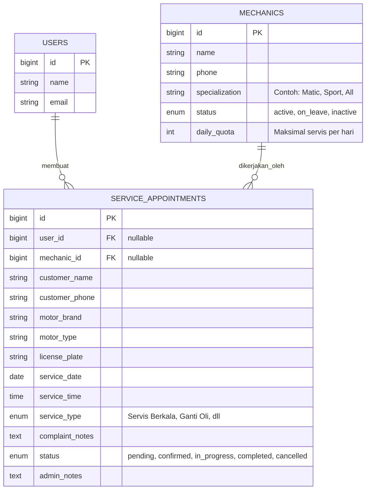

# Rencana Pengembangan Fitur Servis & Manajemen Mekanik

**Sistem Informasi Dealer SRB Motor (Powered by SSM)**

Dokumen ini berisi spesifikasi teknis dan desain alur kerja (workflow) untuk fitur Reservasi Servis Motor yang dilengkapi dengan sistem pengelolaan Ketersediaan Mekanik. Fitur ini dirancang untuk menjawab tantangan operasional harian bengkel agar pelanggan tidak melakukan reservasi saat mekanik sedang penuh atau tidak tersedia.

---

## 1. Konsep Utama & Solusi

Untuk menjawab masalah _"Bagaimana user tahu jika mekanik sedang tidak ada?"_, kita akan menggunakan pendekatan **Dynamic Quota & Mechanic Assignment** (Kuota Dinamis dan Penugasan Mekanik).

1. **Manajemen Data Mekanik:** Sistem akan memiliki tabel khusus `mechanics` beserta status kerjanya (`aktif`, `cuti`, `nonaktif`).
2. **Kalkulasi Kuota Otomatis:** Di sisi User (Frontend), tanggal dan jam servis hanya bisa dipilih jika masih ada mekanik yang berstatus `aktif` dan belum memenuhi batas maksimal perbaikan motor pada jam/hari tersebut.
3. **Admin Assignment:** Admin bengkel bertugas menerima reservasi (`pending`) dan menugaskan reservasi tersebut ke mekanik spesifik yang tersedia (`confirmed`).

---

## 2. Struktur Database (Schema & ERD)

### Entity Relationship Diagram (ERD)

### Penambahan & Modifikasi Tabel:

1. **Tabel `mechanics` (Baru):**
    - Menyimpan daftar mekanik berserta status (`active` / `on_leave`).
    - Jika mekanik sedang sakit/cuti, admin cukup mengubah status menjadi `on_leave`.

2. **Tabel `service_appointments` (Modifikasi):**
    - Menambahkan kolom `mechanic_id` (Foreign Key ke tabel mechanics).
    - Kolom status (`pending`, `confirmed`, `in_progress`, `completed`, `cancelled`).

---

## 3. Alur Sistem (Business Logic Workflow)

### A. Alur Pelanggan (User / Customer)

1. User masuk ke halaman **Booking Servis**.
2. User memilih Tanggal Servis.
3. **Pengecekan Sistem (Validasi Ketersediaan):**
    - _Logika:_ Sistem mengecek jumlah mekanik berstatus `active` di hari tersebut dikali batas kuota. Jika jadwal penuh atau tidak ada mekanik `active`, kalender untuk tanggal/jam tersebut akan **didisable (diwarnai abu-abu)** dan tidak bisa diklik.
    - _Pesan UI:_ "Mohon maaf, jadwal pada tanggal ini sudah penuh atau mekanik sedang tidak tersedia."
4. Jika tersedia, user mengisi form (Plat Nomor, Keluhan, Tipe Motor).
5. Reservasi berhasil dengan status awal **`Pending`**.

### B. Alur Bengkel (Admin / Service Advisor)

1. Admin melihat pendaftaran servis baru di Dashboard.
2. Admin mengecek ketersediaan riil mesin dan alat.
3. Admin memilih mekanik dari dropdown (menugaskan `mechanic_id`).
4. Admin menekan tombol **"Konfirmasi Booking"** (status berubah dari `pending` menjadi `confirmed`).
5. Pelanggan otomatis mendapat notifikasi/email bahwa servis dijadwalkan bersama Mekanik \[Nama Mekanik].

### C. Alur Pengerjaan (Hari H)

1. Pelanggan datang ke SRB Motor membawa motornya.
2. Motor mulai dikerjakan, Admin/Mekanik mengubah status menjadi **`In Progress`**.
3. Setelah selesai, status diubah menjadi **`Completed`**. Form Invoices Servis dapat di-generate (opsional jika dikaitkan dengan sistem kasir).

---

## 4. Keunggulan Sistem Secara Akademik & Profesional

Jika ditanya oleh Dosen penguji terkait validasi operasional bisnis, sistem ini menunjukkan _Business Case_ yang solid:

- **Preventive Error:** Mencegah masalah riil bengkel yaitu _overbooking_ saat kekurangan staf mekanik.
- **Traceability:** Admin dan bengkel pusat (SSM) dapat melacak mekanik mana yang menangani motor pelanggan tertentu jika terjadi keluhan (garansi servis).
- **Efisiensi:** Mengubah sistem booking konvensional (mengantri fisik tidak pasti) menjadi kepastian ketersediaan _slot_ waktu digital.

---

## 5. Rencana Eksekusi Teknis Berikutnya (Next Steps)

1. Membuat Migration & Model `Mechanic`.
2. Melakukan modifikasi Migration `service_appointments` untuk menambahkan Foreign Key `mechanic_id`.
3. Membangun halaman Admin untuk `Mechanic Management` (Tambah/Edit/Ubah Status Cuti).
4. Membuat API endpoint untuk mengecek slot kosong berdasarkan ketersediaan mekanik pada Frontend React.
5. Membangun UI Booking Form di Frontend menggunakan Inertia & React.
