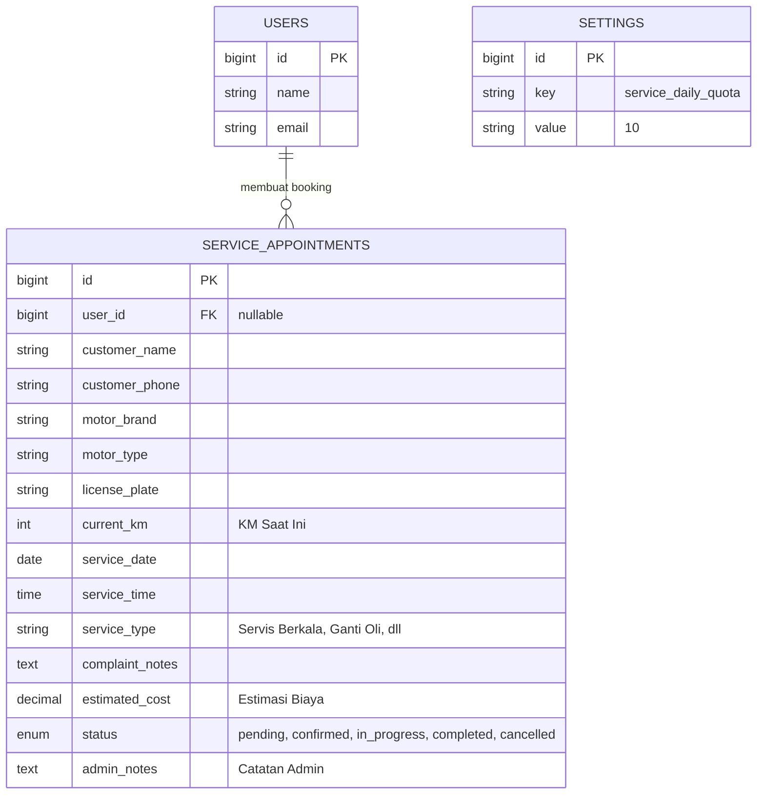

# Rencana Pengembangan Fitur Servis (SSM Authorized)

**Sistem Informasi Dealer SRB Motor (Powered by SSM)**

Dokumen ini berisi spesifikasi teknis untuk fitur Reservasi Servis Motor yang dirancang sederhana namun fungsional sesuai standar **SSM Authorized Dealer**. Sistem menggunakan pendekatan **Sistem Kuota Harian** agar manajemen mekanik tetap efisien tanpa tabel yang rumit.

---

## 1. Konsep Utama: Quota-Based Booking

Untuk menjaga kualitas layanan resmi, sistem akan membatasi jumlah pengerjaan harian:

1. **Daily Quota Management:** Admin menetapkan batas maksimal servis per hari (Default: 10-15 motor).
2. **Real-time Calendar Blocking:** Di sisi pelanggan, tanggal yang sudah penuh akan otomatis berwarna MERAH dan terkunci (Disabled) agar tidak terjadi penumpukan di bengkel.
3. **Admin Quick Approval:** Admin memiliki kendali penuh untuk menyetujui, menjadwalkan ulang, atau membatalkan booking jika diperlukan.

---

## 2. Struktur Database (Lean Schema)

Hanya menggunakan satu tabel utama untuk menjaga sistem tetap ringan.

### Entity Relationship Diagram (ERD)

### Tabel: `service_appointments`
| Field | Tipe | Deskripsi |
|---|---|---|
| `id` | PK | Primary Key |
| `user_id` | FK | ID User (Null jika tamu/offline) |
| `customer_name` | String | Nama Lengkap Pelanggan |
| `customer_phone` | String | Nomor WhatsApp Aktif |
| `motor_brand` | String | Contoh: Honda, Yamaha |
| `motor_type` | String | Contoh: Vario 160, NMAX |
| `license_plate` | String | Nomor Polisi (Penting untuk riwayat) |
| **`current_km`** | Integer | **Kilometer saat ini (Standar SSM)** |
| `service_date` | Date | Tanggal Reservasi |
| `service_time` | Time | Jam Kedatangan |
| `service_type` | Enum | Berkala, Ganti Oli, Perbaikan Berat, dll |
| `complaint_notes`| Text | Keluhan atau catatan dari pelanggan |
| **`estimated_cost`**| Decimal | **Estimasi biaya (Diisi Admin/User)** |
| `status` | Enum | pending, confirmed, in_progress, completed, cancelled |
| `admin_notes` | Text | Catatan/Alasan dari Admin (misal: Alasan Reject) |

---

## 3. Alur Kerja (Workflow)

### A. Alur Pelanggan (User)
1. Akses halaman **Booking Servis**.
2. Pilih tanggal di kalender. Jika Hijau = Tersedia, Jika Merah = Penuh.
3. Isi data motor, plat nomor, dan **KM Saat Ini**.
4. Submit -> Status awal: `Pending`.

### B. Alur Kendali (Admin)
1. Notifikasi masuk ke Dashboard.
2. Admin melakukan verifikasi:
    - **Confirmed:** Booking disetujui, slot kuota terkunci.
    - **Cancelled:** Booking ditolak (misal: mekanik libur mendadak). Admin mengisi alasan penolakan.
3. Saat motor dikerjakan, status diubah ke `In Progress`.
4. Saat selesai, status diubah ke `Completed`. Estimasi biaya akhir dicatat.

---

## 4. Keunggulan untuk SRB Motor (Authorized)

- **Transparansi:** Pelanggan tahu kapan bengkel penuh dan tidak.
- **Kredibilitas:** Menanyakan KM motor adalah ciri khas dealer resmi yang profesional.
- **Efisiensi:** Admin tidak perlu mengelola jadwal mekanik satu per satu, cukup kelola total kuota harian.

---

## 5. Langkah Eksekusi (Next Steps)
1. Generate Migration & Model `ServiceAppointment`.
2. Buat API untuk cek ketersediaan kuota per tanggal.
3. Implementasi Kalender Interaktif di Frontend (React).
4. Buat Dashboard Admin untuk kelola antrian servis harian.

