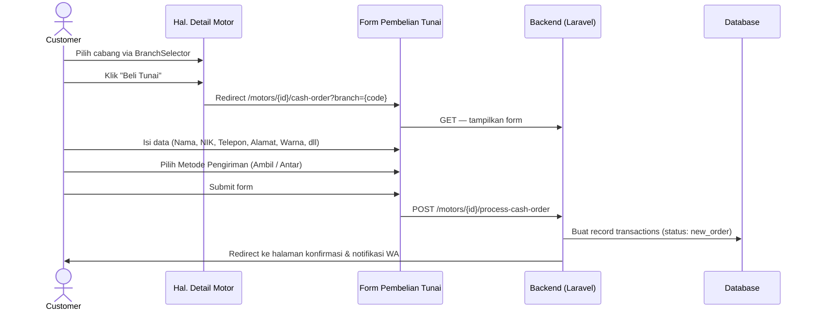
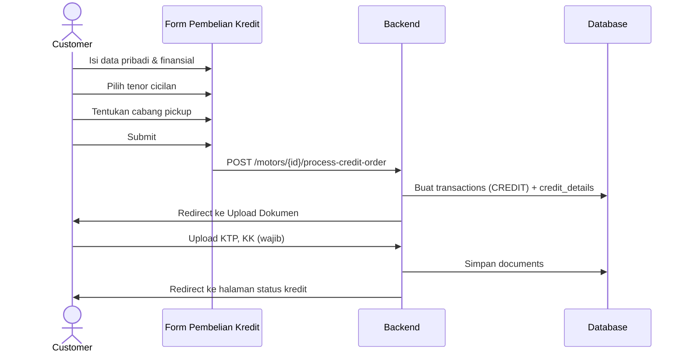
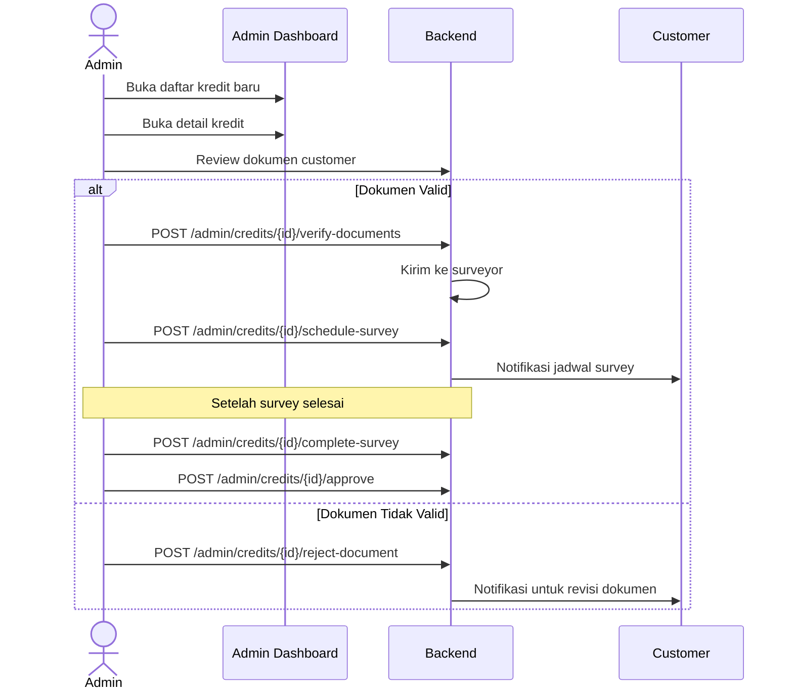
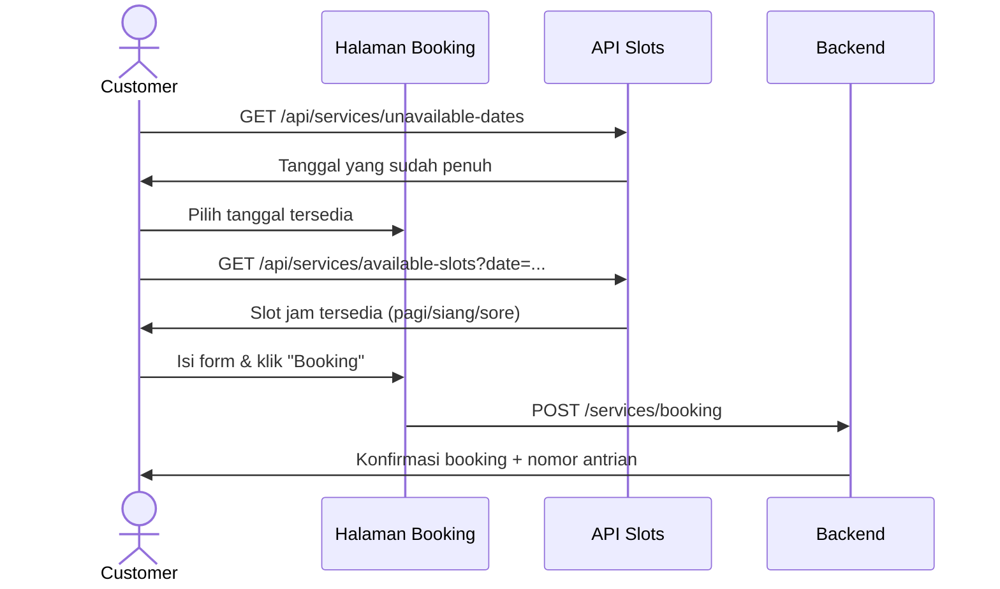

# 📋 SRB Motor — Analisis Use Case Per-Flow (Complete)

Dokumen ini memetakan **setiap alur interaksi** yang tersedia di sistem SRB Motor secara mendetail, mulai dari perspektif pengguna hingga respons sistem. Setiap use case dilengkapi dengan _actor_, _pre-condition_, _langkah alur_, dan _post-condition_.

---

## Daftar Isi

1. [Flow 1: Registrasi & Autentikasi](#1-flow-autentikasi--registrasi)
2. [Flow 2: Eksplorasi Katalog Motor](#2-flow-eksplorasi-katalog-motor)
3. [Flow 3: Pembelian Tunai (Cash Order)](#3-flow-pembelian-tunai-cash-order)
4. [Flow 4: Pembelian Kredit (Credit Order)](#4-flow-pembelian-kredit-credit-order)
5. [Flow 5: Pembayaran via Gateway (Midtrans)](#5-flow-pembayaran-via-gateway-midtrans)
6. [Flow 6: Manajemen Dokumen Kredit](#6-flow-manajemen-dokumen-kredit)
7. [Flow 7: Proses Approval Kredit (Admin)](#7-flow-proses-approval-kredit-admin)
8. [Flow 8: Cicilan & Pembayaran Angsuran](#8-flow-cicilan--pembayaran-angsuran)
9. [Flow 9: Booking Servis Kendaraan](#9-flow-booking-servis-kendaraan)
10. [Flow 10: Manajemen Lokasi & Cabang](#10-flow-manajemen-lokasi--cabang)
11. [Flow 11: Notifikasi Sistem](#11-flow-notifikasi-sistem)
12. [Flow 12: Manajemen Profil](#12-flow-manajemen-profil)
13. [Flow 13: Admin — Manajemen Motor (CRUD)](#13-flow-admin--manajemen-motor-crud)
14. [Flow 14: Admin — Manajemen Transaksi Tunai](#14-flow-admin--manajemen-transaksi-tunai)
15. [Flow 15: Admin — Manajemen Servis](#15-flow-admin--manajemen-servis)
16. [Flow 16: Admin — Manajemen Cicilan](#16-flow-admin--manajemen-cicilan)
17. [Flow 17: Owner — Laporan & Export](#17-flow-owner--laporan--export)
18. [Flow 18: Owner — Manajemen Admin/Staf](#18-flow-owner--manajemen-adminstaf)
19. [Flow 19: Admin — Manajemen Settings & Cabang](#19-flow-admin--manajemen-settings--cabang)
20. [Flow 20: Pembatalan Pemesanan](#20-flow-pembatalan-pemesanan)

---

## Aktor Sistem

| Aktor        | Tipe     | Deskripsi                                                                 |
| ------------ | -------- | ------------------------------------------------------------------------- |
| **Guest**    | External | Pengunjung yang belum login. Akses terbatas pada informasi publik.        |
| **Customer** | External | Pengguna terdaftar. Dapat melakukan pembelian, servis, dan melihat akun.  |
| **Admin**    | Internal | Staf operasional. Mengelola inventori, transaksi, dan servis.             |
| **Owner**    | Internal | Super Admin. Akses penuh termasuk laporan keuangan dan akun staf.         |
| **System**   | Internal | Sistem backend (Laravel + Midtrans Webhook + Geolocation API).            |

---

## 1. Flow: Autentikasi & Registrasi

### UC-AUTH-01: Registrasi Akun Baru (Email)

| Atribut       | Nilai                                                           |
| ------------- | --------------------------------------------------------------- |
| **Actor**     | Guest                                                           |
| **Pre-cond**  | Belum memiliki akun, akses ke halaman beranda atau modal login  |
| Post-cond | Akun baru terbuat, otomatis login, diarahkan ke Katalog      |

**Alur Normal:**
1. Guest membuka modal pendaftaran dari tombol "Daftar" di navbar.
2. Guest mengisi: Nama lengkap, Email, Password, Konfirmasi Password.
3. System memvalidasi data (unik email, kesesuaian password, format valid).
4. System membuat record `users` baru dengan `role = user`.
5. System melakukan **Auto-Login** untuk pengguna tersebut.
6. System mengalihkan (redirect) pengguna ke halaman **Katalog Motor**.
7. System menampilkan notifikasi sukses dan mengirim email verifikasi di latar belakang.

**Alur Alternatif (Email sudah terdaftar):**
- System menampilkan pesan error: "Email sudah terdaftar."

---

### UC-AUTH-02: Login Email & Password

| Atribut       | Nilai                                                   |
| ------------- | ------------------------------------------------------- |
| **Actor**     | Guest, Admin, Owner                                     |
| **Pre-cond**  | Memiliki akun yang terdaftar                            |
| **Post-cond** | Session terotentikasi, diarahkan sesuai role            |

**Alur Normal:**
1. Guest membuka modal login dari navbar.
2. Memasukkan Email dan Password.
3. System validate credentials via `AuthController::login`.
4. System membuat session auth.
5. System melakukan redirect berdasarkan `role`:
   - `customer` → `/` (beranda)
   - `admin` / `owner` → `/admin`

**Alur Alternatif (Gagal):**
- Throttle aktif setelah 5 kali gagal dalam 1 menit (HTTP 429).
- Tampilkan pesan: "Kredensial tidak valid."

---

### UC-AUTH-03: Login via Google SSO

| Atribut       | Nilai                                               |
| ------------- | --------------------------------------------------- |
| **Actor**     | Guest                                               |
| **Pre-cond**  | Memiliki akun Google                                |
| **Post-cond** | Akun terhubung dengan Google, session aktif         |

**Alur Normal:**
1. Guest menekan "Masuk dengan Google".
2. Browser diarahkan ke `/auth/google` → Google OAuth.
3. Google mengirimkan authorization code ke `/auth/google/callback`.
4. System `GoogleAuthController` menukar kode dengan profil pengguna.
5. Jika email belum terdaftar → System membuat akun baru secara otomatis.
6. Jika email sudah ada → System menggabungkan (link) akun Google.
7. Session aktif. Guest diarahkan ke halaman sebelumnya.

---

### UC-AUTH-04: Verifikasi Email

| Atribut       | Nilai                                                      |
| ------------- | ---------------------------------------------------------- |
| **Actor**     | Customer (baru terdaftar)                                  |
| **Pre-cond**  | Sudah daftar, email verifikasi terkirim                    |
| **Post-cond** | Field `email_verified_at` terisi, akses penuh terbuka      |

**Alur Normal:**
1. Customer membuka email, klik link verifikasi.
2. System memvalidasi signature link (via `EmailVerificationRequest`).
3. System mengisi `email_verified_at` di tabel `users`.
4. Customer diarahkan ke beranda dengan pesan sukses.

**Ekstensi — Kirim Ulang:**
- Customer di dashboard mengklik "Kirim Ulang Verifikasi."
- System mengirim email baru (throttle: max 6 kali per menit).

---

### UC-AUTH-05: Logout

| Atribut       | Nilai                                      |
| ------------- | ------------------------------------------ |
| **Actor**     | Customer, Admin, Owner                     |
| **Pre-cond**  | Session aktif                              |
| **Post-cond** | Session dihapus, diarahkan ke beranda      |

**Alur Normal:**
1. User menekan tombol "Keluar" di navbar/sidebar.
2. Request `POST /logout` dikirim ke `AuthController::logout`.
3. System menghapus session aktif.
4. User diarahkan ke halaman beranda.

---

## 2. Flow: Eksplorasi Katalog Motor

### UC-CAT-01: Melihat Daftar Motor

| Atribut       | Nilai                          |
| ------------- | ------------------------------ |
| **Actor**     | Guest, Customer                |
| **Pre-cond**  | —                              |
| **Post-cond** | Halaman katalog ditampilkan    |

**Alur Normal:**
1. User mengakses `/motors`.
2. `MotorGalleryController::index` mengambil motor dengan status `tersedia = true`.
3. System menampilkan kartu motor: foto utama, nama, harga, status stok.
4. Jika stok habis, badge "Stok Habis" tampil dan tombol beli dinonaktifkan.

---

### UC-CAT-02: Filter & Pencarian Motor

| Atribut       | Nilai                                                 |
| ------------- | ----------------------------------------------------- |
| **Actor**     | Guest, Customer                                       |
| **Pre-cond**  | —                                                     |
| **Post-cond** | Daftar motor terfilter berdasarkan kriteria pengguna  |

**Alur Normal:**
1. User memasukkan kata kunci di search bar (live search via `/api/search/motors`).
2. User memilih filter: Kategori (Matic/Sport/etc), Rentang Harga, Merek.
3. System mengembalikan hasil secara dinamis tanpa reload halaman.
4. User bisa mereset filter ke kondisi awal.

---

### UC-CAT-03: Melihat Detail Motor

| Atribut       | Nilai                                               |
| ------------- | --------------------------------------------------- |
| **Actor**     | Guest, Customer                                     |
| **Pre-cond**  | Motor tersedia dalam katalog                        |
| **Post-cond** | Halaman detail dengan ketersediaan cabang tampil    |

**Alur Normal:**
1. User mengklik kartu motor → `/motors/{motor}`.
2. System menampilkan: foto galeri, spesifikasi, harga, warna tersedia.
3. System menampilkan komponen `BranchSelector` untuk memilih lokasi pickup.
4. Jika motor tersedia, tombol "Beli Tunai" dan "Beli Kredit" aktif.
5. Jika motor habis, tombol dinonaktifkan dan status "Stok Habis" tampil.

---

### UC-CAT-04: Perbandingan Motor

| Atribut       | Nilai                                                  |
| ------------- | ------------------------------------------------------ |
| **Actor**     | Guest, Customer                                        |
| **Pre-cond**  | —                                                      |
| **Post-cond** | Tabel perbandingan spesifikasi dua motor tampil         |

**Alur Normal:**
1. User mengakses `/motors/compare`.
2. User memilih dua motor dari dropdown.
3. System menampilkan tabel perbandingan: mesin, harga, bobot, dan fitur.

---

## 3. Flow: Pembelian Tunai (Cash Order)



### UC-CASH-01: Mengisi & Submit Form Pesanan Tunai

| Atribut       | Nilai                                                                 |
| ------------- | --------------------------------------------------------------------- |
| **Actor**     | Customer                                                              |
| **Pre-cond**  | Login, email terverifikasi, motor tersedia, cabang dipilih            |
| **Post-cond** | Transaksi baru di DB, status `new_order`, notifikasi WA terkirim      |

**Data yang Diisi Customer:**
- Nama Lengkap, NIK KTP, Nomor Telepon, Email, Alamat Lengkap
- Pilihan Warna Motor
- Metode Pengambilan (Ambil Sendiri / Diantar)
- Tanggal Pengambilan/Pengiriman (jika diantar)
- Pekerjaan, Penghasilan Bulanan
- Lokasi Cabang Pickup (`branch_code`)
- Catatan Tambahan (opsional)

**Validasi Sistem:**
- Throttle: maks 15 request per menit.
- Motor harus `tersedia = true` saat submit.
- Semua field wajib terisi dengan format valid.

**Alur Normal:**
1. Customer mengisi seluruh form.
2. System validasi data via `MotorGalleryController::processCashOrder`.
3. System membuat record di tabel `transactions` dengan `transaction_type = CASH`.
4. System **mengirimkan notifikasi WhatsApp** ke admin (include behavior).
5. System **memperbarui status stok motor** (extend behavior — jika konfigurasi diaktifkan).
6. Customer diarahkan ke halaman konfirmasi pesanan.

---

## 4. Flow: Pembelian Kredit (Credit Order)



### UC-CREDIT-01: Submit Form Kredit & Upload Dokumen

| Atribut       | Nilai                                                                         |
| ------------- | ----------------------------------------------------------------------------- |
| **Actor**     | Customer                                                                      |
| **Pre-cond**  | Login, motor tersedia, cabang dipilih                                         |
| **Post-cond** | Transaksi & credit_detail terbuat, dokumen terupload, status `menunggu_persetujuan` |

**Data Tambahan vs Cash:**
- Lama Bekerja (Employment Duration)
- Pilihan Tenor (12/24/36 bulan, dsb.)
- Uang Muka (DP) yang diinginkan
- Lembaga Leasing yang dipilih

**Include Behavior — Upload Dokumen (Wajib):**
1. Setelah submit kredit, Customer **wajib** mengunggah:
   - Foto KTP (depan)
   - Foto Kartu Keluarga (KK)
2. Dokumen disimpan di storage, record di tabel `documents`.
3. Credit detail status → `menunggu_persetujuan`.

---

## 5. Flow: Pembayaran via Gateway (Midtrans)

### UC-PAY-01: Pembayaran Online via Midtrans

| Atribut       | Nilai                                                              |
| ------------- | ------------------------------------------------------------------ |
| **Actor**     | Customer, System (Webhook)                                         |
| **Pre-cond**  | Transaksi dibuat, invoice terbuat                                  |
| **Post-cond** | Pembayaran terkonfirmasi, status transaksi diperbarui              |

**Alur Normal:**
1. Customer membuka halaman transaksi.
2. Customer memilih "Bayar Online" dan memilih installment.
3. System POST ke `/installments/{id}/pay-online` → Midtrans API.
4. System mengembalikan `payment_token` Midtrans.
5. Frontend membuka popup Midtrans Snap.
6. Customer memilih metode bayar (Transfer / QRIS / CC / dll.).
7. Customer menyelesaikan pembayaran.
8. Midtrans mengirimkan **Webhook** ke backend (async).
9. System `InstallmentController::checkPaymentStatus` memverifikasi pembayaran.
10. System memperbarui status installment → `paid` dan status transaksi.
11. Customer diarahkan ke `/payments/success`.

**Alur Alternatif (Cek Manual):**
- Customer mengklik "Cek Status Pembayaran" di halaman installment.
- System melakukan polling ke Midtrans API untuk status terkini.

---

## 6. Flow: Manajemen Dokumen Kredit

### UC-DOC-01: Upload Dokumen Awal

| Atribut       | Nilai                                                           |
| ------------- | --------------------------------------------------------------- |
| **Actor**     | Customer                                                        |
| **Pre-cond**  | Transaksi kredit sudah dibuat                                   |
| **Post-cond** | Dokumen tersimpan, status pengajuan diperbarui                  |

**Alur Normal:**
1. Customer mengakses `/motors/{transaction}/upload-credit-documents`.
2. Customer mengunggah KTP dan KK (format: JPG/PNG/PDF, max 5MB).
3. System `MotorGalleryController::uploadCreditDocuments` memvalidasi & menyimpan.
4. Record dokumen dibuat di tabel `documents`.

---

### UC-DOC-02: Update / Revisi Dokumen

| Atribut       | Nilai                                                          |
| ------------- | -------------------------------------------------------------- |
| **Actor**     | Customer                                                       |
| **Pre-cond**  | Dokumen sebelumnya ditolak oleh Admin                          |
| **Post-cond** | Dokumen baru terupload, status kembali ke `menunggu_persetujuan` |

**Alur Normal:**
1. Customer menerima notifikasi "Dokumen Ditolak."
2. Customer mengakses `/motors/{transaction}/manage-documents`.
3. Customer mengedit atau mengganti file dokumen.
4. System menyimpan versi dokumen baru dan mereset status ke `menunggu_persetujuan`.

---

## 7. Flow: Proses Approval Kredit (Admin)



### UC-ADMIN-CREDIT-01: Alur Lengkap Approval Kredit

| Atribut       | Nilai                                                                 |
| ------------- | --------------------------------------------------------------------- |
| **Actor**     | Admin                                                                 |
| **Pre-cond**  | Ada pengajuan kredit baru dari Customer                               |
| **Post-cond** | Kredit disetujui/ditolak, transaksi diperbarui, Customer dinotifikasi |

**Tahapan yang tersedia:**

1. **`menunggu_persetujuan`** — Admin review dokumen Customer.
2. **`verify-documents`** — Admin verifikasi dokumen valid.
3. **`reject-document`** — Admin tolak (Customer dapat revisi).
4. **`send-to-leasing`** — Admin kirim berkas ke lembaga leasing.
5. **`schedule-survey`** — Admin jadwalkan survei ke lokasi Customer.
6. **`start-survey`** — Surveyor memulai kunjungan.
7. **`complete-survey`** — Survei selesai.
8. **`approve`** — Kredit disetujui, Customer dinotifikasi.
9. **`reject`** — Kredit ditolak final.
10. **`record-dp-payment`** — Admin mencatat pembayaran DP.
11. **`complete`** — Transaksi kredit selesai.
12. **`cancel`** — Pembatalan transaksi.
13. **`repossess`** — Penarikan unit (situasi gagal bayar).

---

### UC-ADMIN-CREDIT-02: Konfirmasi Survey (Customer Side)

| Atribut       | Nilai                                                         |
| ------------- | ------------------------------------------------------------- |
| **Actor**     | Customer                                                      |
| **Pre-cond**  | Admin telah menjadwalkan survey                               |
| **Post-cond** | Customer mengkonfirmasi atau meminta penjadwalan ulang        |

**Alur Normal:**
1. Customer menerima notifikasi jadwal survey.
2. Customer membuka halaman status kredit.
3. Customer mengklik "Konfirmasi Kehadiran" → `POST /survey-schedules/{id}/confirm-attendance`.
4. Jika tidak bisa hadir: "Minta Jadwal Ulang" → `POST /survey-schedules/{id}/request-reschedule`.

---

## 8. Flow: Cicilan & Pembayaran Angsuran

### UC-INST-01: Lihat & Bayar Cicilan

| Atribut       | Nilai                                                         |
| ------------- | ------------------------------------------------------------- |
| **Actor**     | Customer                                                      |
| **Pre-cond**  | Transaksi kredit disetujui, cicilan terbuat                   |
| **Post-cond** | Cicilan bertanda `paid`, transaksi diperbarui                 |

**Alur Normal:**
1. Customer mengakses `/installments`.
2. System menampilkan daftar cicilan: tanggal jatuh tempo, jumlah, status, denda.
3. Customer memilih cicilan untuk dibayar.
4. **Bayar Manual (Offline):** Konfirmasi via form → Admin approve di panel.
5. **Bayar Online (Midtrans):** Ikuti UC-PAY-01.
6. **Bayar Banyak Sekaligus:** POST `/installments/pay-multiple` (batch payment).

---

### UC-INST-02: Download Bukti Bayar Cicilan

| Atribut       | Nilai                                                  |
| ------------- | ------------------------------------------------------ |
| **Actor**     | Customer                                               |
| **Pre-cond**  | Cicilan berstatus `paid`                               |
| **Post-cond** | File PDF kwitansi terunduh                             |

**Alur Normal:**
1. Customer mengklik "Download Kwitansi" pada cicilan yang sudah lunas.
2. System menghasilkan PDF kwitansi via `InstallmentController::downloadReceipt`.
3. Browser langsung mengunduh file.

---

### UC-INST-03: Konfirmasi Pembayaran Cicilan (Admin)

| Atribut       | Nilai                                                     |
| ------------- | --------------------------------------------------------- |
| **Actor**     | Admin                                                     |
| **Pre-cond**  | Customer mengajukan konfirmasi bayar manual               |
| **Post-cond** | Cicilan berstatus `paid`, Customer dinotifikasi           |

**Alur Normal:**
1. Admin membuka daftar cicilan di `/admin/installments`.
2. Admin memeriksa bukti transfer.
3. Admin mengklik "Approve" → `POST /admin/installments/{id}/approve`.
4. System memperbarui status cicilan dan membuat log transaksi.
5. Atau Admin mengklik "Reject" → Customer diminta ulang.

---

## 9. Flow: Booking Servis Kendaraan



### UC-SERVICE-01: Booking Servis Kendaraan

| Atribut       | Nilai                                                             |
| ------------- | ----------------------------------------------------------------- |
| **Actor**     | Customer                                                          |
| **Pre-cond**  | Login, motor yang dimiliki diketahui                              |
| **Post-cond** | Jadwal servis terdaftar, nomor antrian diberikan                  |

**Data yang Diisi:**
- Jenis Kendaraan, Plat Nomor, Tahun
- Keluhan / Jenis Servis (rutin / perbaikan)
- Cabang yang dipilih (dropdown dari data master cabang)
- Tanggal & slot waktu yang tersedia

**Include Behavior:**
- System otomatis mengecek ketersediaan slot sebelum konfirmasi.

---

### UC-SERVICE-02: Lihat & Batalkan Booking

| Atribut       | Nilai                                                    |
| ------------- | -------------------------------------------------------- |
| **Actor**     | Customer                                                 |
| **Pre-cond**  | Booking aktif                                            |
| **Post-cond** | Booking dibatalkan, slot waktu kembali tersedia          |

**Alur Normal:**
1. Customer membuka `/services` → daftar booking aktif.
2. Customer mengklik detail booking → `/services/{id}`.
3. Customer menekan "Batalkan Booking" (jika belum melewati batas waktu).
4. System memperbarui status dan melepas slot tersebut.

---

### UC-SERVICE-03: Manajemen Servis (Admin)

| Atribut       | Nilai                                                    |
| ------------- | -------------------------------------------------------- |
| **Actor**     | Admin                                                    |
| **Pre-cond**  | Ada booking servis dari Customer                         |
| **Post-cond** | Status antrian diperbarui                                |

**Status yang Tersedia:**
- `pending` → Menunggu konfirmasi admin.
- `confirmed` → Booking dikonfirmasi, antrian aktif.
- `in_progress` → Kendaraan sedang diservis.
- `completed` → Servis selesai.
- `cancelled` → Dibatalkan oleh admin.

---

## 10. Flow: Manajemen Lokasi & Cabang

### UC-BRANCH-01: Cari Cabang Terdekat via GPS

| Atribut       | Nilai                                                              |
| ------------- | ------------------------------------------------------------------ |
| **Actor**     | Guest, Customer                                                    |
| **Pre-cond**  | Browser mendukung Geolocation API, izin lokasi diberikan          |
| **Post-cond** | Daftar cabang terurut berdasarkan jarak, stok unit tampil          |

**Alur Normal:**
1. User membuka halaman detail motor.
2. User mengklik "Cari Cabang Terdekat" di komponen `BranchSelector`.
3. Browser meminta izin akses GPS.
4. JS mengirimkan koordinat ke API `/api/branches?motor_id={id}`.
5. Backend menghitung jarak (Haversine Formula) dan memeriksa stok per cabang (1 query).
6. System mengembalikan daftar cabang terurut dari terdekat beserta info stok unit.
7. User memilih cabang yang diinginkan.

---

### UC-BRANCH-02: Pilih Cabang Manual

| Atribut       | Nilai                                                   |
| ------------- | ------------------------------------------------------- |
| **Actor**     | Guest, Customer                                         |
| **Pre-cond**  | Halaman detail motor atau form pemesanan terbuka        |
| **Post-cond** | Cabang terpilih, info lokasi tersimpan di form          |

**Alur Normal:**
1. User memilih cabang dari dropdown di form pesanan.
2. System langsung menampilkan alamat, nomor telepon, dan jam operasional.
3. `branch_code` tersimpan sebagai state untuk dikirim saat submit form.

---

### UC-BRANCH-03: Simpan Cabang Favorit (Customer)

| Atribut       | Nilai                                                   |
| ------------- | ------------------------------------------------------- |
| **Actor**     | Customer                                                |
| **Pre-cond**  | Login, cabang valid                                     |
| **Post-cond** | Kolom `preferred_branch` di tabel `users` diperbarui   |

**Alur Normal:**
1. Customer memilih cabang dan mengklik "Simpan Cabang Favorit."
2. System POST ke `/api/branches/set-preferred`.
3. System menyimpan `branch_code` ke kolom `users.preferred_branch`.
4. Saat Customer membuka form pesanan berikutnya, cabang ini menjadi default.

---

## 11. Flow: Notifikasi Sistem

### UC-NOTIF-01: Menerima & Mengelola Notifikasi

| Atribut       | Nilai                                                         |
| ------------- | ------------------------------------------------------------- |
| **Actor**     | Customer, Admin                                               |
| **Pre-cond**  | Login, ada event pemicu notifikasi                            |
| **Post-cond** | Notifikasi tampil di panel, bisa ditandai baca/hapus          |

**Event Pemicu Notifikasi:**
- ✅ Pesanan baru masuk (Admin).
- ✅ Dokumen kredit disetujui/ditolak (Customer).
- ✅ Jadwal survey terjadwal (Customer).
- ✅ Pembayaran cicilan dikonfirmasi (Customer).
- ✅ Servis selesai (Customer).

**Operasi yang Tersedia:**
- `GET /notifications` — Lihat semua notifikasi.
- `GET /notifications/unread-count` — Hitung notifikasi belum dibaca.
- `POST /notifications/{id}/read` — Tandai satu notifikasi sebagai dibaca.
- `POST /notifications/mark-all-read` — Tandai semua sebagai dibaca.
- `DELETE /notifications/{id}` — Hapus notifikasi.

---

## 12. Flow: Manajemen Profil

### UC-PROFILE-01: Edit Profil Customer

| Atribut       | Nilai                                                   |
| ------------- | ------------------------------------------------------- |
| **Actor**     | Customer                                                |
| **Pre-cond**  | Login                                                   |
| **Post-cond** | Data profil diperbarui di tabel `users`                 |

**Data yang Bisa Diubah:**
- Nama, Email, Nomor Telepon, Alamat
- Foto Profil
- Pekerjaan, Penghasilan

---

### UC-PROFILE-02: Ubah Password

| Atribut       | Nilai                                                   |
| ------------- | ------------------------------------------------------- |
| **Actor**     | Customer, Admin                                         |
| **Pre-cond**  | Login, mengetahui password lama                         |
| **Post-cond** | Password diperbarui                                     |

**Alur Normal:**
1. User mengakses `/profile/edit`.
2. Mengisi: Password Lama, Password Baru, Konfirmasi Password Baru.
3. System validasi kesesuaian dan kekuatan password.
4. System meng-hash dan menyimpan password baru.
5. Tampil pesan: "Password berhasil diperbarui."

---

### UC-PROFILE-03: Lihat Riwayat Transaksi

| Atribut       | Nilai                                                  |
| ------------- | ------------------------------------------------------ |
| **Actor**     | Customer                                               |
| **Pre-cond**  | Login, memiliki transaksi                              |
| **Post-cond** | Daftar transaksi tampil dengan status terkini          |

**Alur Normal:**
1. Customer mengakses `/motors/my-transactions`.
2. System menampilkan semua transaksi milik Customer.
3. Customer dapat mengklik transaksi untuk melihat detail lengkap.

---

## 13. Flow: Admin — Manajemen Motor (CRUD)

### UC-MOTOR-01: Tambah Motor Baru

| Atribut       | Nilai                                              |
| ------------- | -------------------------------------------------- |
| **Actor**     | Admin, Owner                                       |
| **Pre-cond**  | Login sebagai admin                                |
| **Post-cond** | Motor baru muncul di katalog publik                |

**Data yang Diisi:**
- Nama, Merek, Model, Kategori (Matic/Sport/Bebek)
- Harga (OTR), Harga Minimum DP
- Warna-warna yang tersedia, Stok per warna
- Cabang/Lokasi
- Deskripsi, Spesifikasi Teknis
- Status: Aktif / Draft

**Extend Behavior — Kelola Galeri:**
- Setelah motor dibuat, Admin dapat mengunggah multiple foto.
- Foto utama ditentukan (thumbnail di katalog).
- Sort urutan foto sesuai keinginan.

---

### UC-MOTOR-02: Edit Motor

| Atribut       | Nilai                                              |
| ------------- | -------------------------------------------------- |
| **Actor**     | Admin, Owner                                       |
| **Pre-cond**  | Motor sudah ada                                    |
| **Post-cond** | Perubahan tersimpan dan tampil di katalog          |

---

### UC-MOTOR-03: Hapus / Draft Motor

| Atribut       | Nilai                                                         |
| ------------- | ------------------------------------------------------------- |
| **Actor**     | Admin, Owner                                                  |
| **Pre-cond**  | Motor ada                                                     |
| **Post-cond** | Motor tersembunyi dari katalog (soft delete) atau dihapus     |

**Aturan Bisnis:**
- Motor yang pernah ada dalam transaksi **tidak bisa di Hard Delete** (DB constraint).
- Admin hanya bisa mengubah status ke **Draft** (Soft Delete).

---

## 14. Flow: Admin — Manajemen Transaksi Tunai

### UC-ADMIN-TRX-01: Update Status Transaksi Cash

| Atribut       | Nilai                                                         |
| ------------- | ------------------------------------------------------------- |
| **Actor**     | Admin                                                         |
| **Pre-cond**  | Transaksi cash baru masuk                                     |
| **Post-cond** | Status transaksi diperbarui, Customer dinotifikasi            |

**Flow Status Transaksi Cash:**
```
new_order → waiting_payment → pembayaran_dikonfirmasi → unit_preparation → ready_for_delivery → dalam_pengiriman → completed
```

**Atau:**
```
new_order → cancelled
```

---

### UC-ADMIN-TRX-02: Download Invoice Transaksi

| Atribut       | Nilai                                               |
| ------------- | --------------------------------------------------- |
| **Actor**     | Admin                                               |
| **Pre-cond**  | Transaksi ada                                       |
| **Post-cond** | File PDF invoice terunduh                           |

**Alur Normal:**
1. Admin membuka detail transaksi.
2. Klik "Preview Invoice" → `/admin/transactions/{id}/invoice`.
3. Klik "Download Invoice" → `/admin/transactions/{id}/invoice/download`.

---

## 15. Flow: Admin — Manajemen Servis

### UC-ADMIN-SERVICE-01: Kelola Antrian Servis

| Atribut       | Nilai                                                     |
| ------------- | --------------------------------------------------------- |
| **Actor**     | Admin                                                     |
| **Pre-cond**  | Ada booking servis dari Customer                          |
| **Post-cond** | Status antrian diperbarui                                 |

**Alur Normal:**
1. Admin membuka `/admin/services`.
2. Daftar booking tampil dengan tanggal, jam, nama Customer, jenis servis.
3. Admin mengubah status via `PUT /admin/services/{id}/status`.
4. System mengirimkan notifikasi ke Customer saat status berubah.

---

## 16. Flow: Admin — Manajemen Cicilan

### UC-ADMIN-INST-01: Approve/Reject Pembayaran Cicilan

| Atribut       | Nilai                                                       |
| ------------- | ----------------------------------------------------------- |
| **Actor**     | Admin                                                       |
| **Pre-cond**  | Customer mengajukan konfirmasi bayar manual                 |
| **Post-cond** | Cicilan terverifikasi atau dikembalikan untuk diulang        |

**Alur Normal:**
- Admin buka panel cicilan, lihat bukti dari Customer.
- `POST /admin/installments/{id}/approve` → cicilan `paid`.
- `POST /admin/installments/{id}/reject` → Customer diminta ulang upload bukti.

---

## 17. Flow: Owner — Laporan & Export

### UC-OWNER-REPORT-01: Generate & Export Laporan

| Atribut       | Nilai                                                        |
| ------------- | ------------------------------------------------------------ |
| **Actor**     | Owner                                                        |
| **Pre-cond**  | Login sebagai Owner                                          |
| **Post-cond** | Laporan ter-generate, file PDF/Excel terunduh                |

**Filter yang Tersedia:**
- Rentang Tanggal
- Jenis Transaksi (Cash / Kredit)
- Cabang (baru ditambahkan)
- Status Transaksi

**Format Export:**
- PDF → `/admin/reports/export`
- Excel (XLSX) → `/admin/reports/export-excel`

**Data yang Tercakup dalam Laporan:**
- Daftar transaksi lengkap
- Data motor yang terjual
- Data Customer
- Kolom Cabang (`branch_code`)
- Total pendapatan per periode

---

## 18. Flow: Owner — Manajemen Admin/Staf

### UC-OWNER-USER-01: CRUD Akun Staf

| Atribut       | Nilai                                                     |
| ------------- | --------------------------------------------------------- |
| **Actor**     | Owner                                                     |
| **Pre-cond**  | Login sebagai Owner                                       |
| **Post-cond** | Akun staf berhasil dibuat / dinonaktifkan / dihapus       |

**Operasi yang Tersedia:**
- `GET /admin/users` → Daftar seluruh staf
- `GET /admin/users/{id}/edit` → Form edit staf
- `PUT /admin/users/{id}` → Update data staf
- `DELETE /admin/users/{id}` → Hapus akun staf
- `POST /admin/users/{id}/toggle-verify` → Verifikasi/suspend akun

---

## 19. Flow: Admin — Manajemen Settings & Cabang

### UC-SETTING-01: Kelola Pengaturan Sistem

| Atribut       | Nilai                                                |
| ------------- | ---------------------------------------------------- |
| **Actor**     | Admin, Owner                                         |
| **Pre-cond**  | Login sebagai admin                                  |
| **Post-cond** | Pengaturan tersimpan, Cache sistem diperbarui        |

**Kategori Settings yang Tersedia:**
- `branches` — Data master cabang (nama, alamat, koordinat, jam operasional, WhatsApp)
- `system` — Konfigurasi umum sistem
- Upload gambar via `POST /admin/settings/upload`

**Alur Edit Data Cabang:**
1. Admin membuka `/admin/settings`.
2. Memilih kategori "Cabang."
3. Mengedit detail cabang: koordinat lat/long, jam buka, nomor WA.
4. Menyimpan → System otomatis membersihkan branch cache.
5. Data cabang baru langsung aktif di frontend tanpa restart server.

---

## 20. Flow: Pembatalan Pemesanan

### UC-CANCEL-01: Pembatalan Oleh Customer

| Atribut       | Nilai                                                      |
| ------------- | ---------------------------------------------------------- |
| **Actor**     | Customer                                                   |
| **Pre-cond**  | Transaksi ada, status masih dalam tahap awal               |
| **Post-cond** | Transaksi berstatus `cancelled`, stok motor dikembalikan   |

**Alur Normal:**
1. Customer membuka detail transaksi.
2. Mengklik "Batalkan Pesanan."
3. System meminta alasan pembatalan.
4. Customer konfirmasi.
5. System POST ke `/motors/{transaction}/cancel`.
6. System mengubah status transaksi ke `cancelled`.
7. System menyimpan waktu (`cancelled_at`) dan alasan (`cancellation_reason`).
8. **Extend Behavior:** System memperbarui status stok motor jika belum dikirim.

---

## Matriks Cross-Reference: Use Case & Tabel Database

| Use Case Flow          | Tabel Utama                                       |
| ---------------------- | ------------------------------------------------- |
| Registrasi / Login     | `users`                                           |
| Eksplorasi Katalog     | `motors`, `motor_galleries`                       |
| Pembelian Cash         | `transactions`                                    |
| Pembelian Kredit       | `transactions`, `credit_details`, `documents`     |
| Cicilan & Pembayaran   | `installments`, `transaction_logs`                |
| Booking Servis         | `service_appointments`                            |
| Cabang & Lokasi        | `settings` (kategori: `branches`), `users`        |
| Notifikasi             | `notifications`                                   |
| Survey                 | `survey_schedules`                                |
| Laporan                | `transactions`, `motors`, `users`, (JOIN semua)   |

---

## Matriks Rate Limiting & Keamanan

| Endpoint / Flow                  | Throttle / Middleware       |
| -------------------------------- | ----------------------------|
| Login                            | `throttle:5,1`              |
| Registrasi                       | `throttle:5,1`              |
| Submit Order (Cash/Credit)       | `throttle:15,1`             |
| Email Verifikasi                 | `throttle:6,1`              |
| API Notifikasi                   | `auth`                      |
| Semua `/admin/*`                 | `auth`, `admin`             |
| Owner reports & user management  | `auth`, `admin`, `owner`    |
| API Cabang (publik)              | Bebas (tanpa throttle)      |
| Simpan Cabang Favorit            | `auth`                      |
