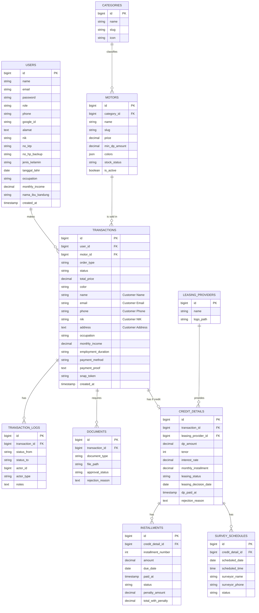

# SRB Motor Database ERD (Consolidated)

This document provides the latest Entity Relationship Diagram (ERD) for the SRB Motor application, reflecting the optimized schema where user profiles are merged into the `users` table and physical motor unit tracking has been simplified.

## Entity Relationship Diagram

## Core Table Descriptions

### users
*Consolidated table containing both authentication data and personal profile information.*
- **nik/no_ktp**: Identification numbers.
- **occupation/monthly_income**: Financial profile for credit assessment.
- **alamat**: Detailed residential address.

### motors
*Catalog of available motorcycle models.*
- **colors**: JSON array of available color variations (e.g. `["Merah", "Hitam", "Putih"]`).
- **min_dp_amount**: Minimum down payment required for credit.
- **stock_status**: General availability (tersedia, habis).

### transactions
*Main record for both Cash and Credit purchases.*
- **order_type**: 'cash' or 'credit'.
- **Customer Fields**: Snapshot of user data at the time of purchase to maintain historical accuracy even if the user profile changes later.
- **color**: Selected color variation for this specific purchase.

### credit_details
*Extra information required specifically for credit transactions.*
- **leasing_status**: Tracking the application progress with the leasing provider (pending, approved, rejected).
- **dp_amount/tenor**: Agreed financial terms.

### installments
*Granular tracking of monthly payments for credit purchases.*
- **penalty_amount**: Automatically calculated if payment is overdue.
- **status**: 'unpaid', 'paid', 'late'.

### documents
*Supporting files (KTP, KK, etc.) uploaded by users for credit verification.*
- **approval_status**: 'pending', 'approved', 'rejected'.
